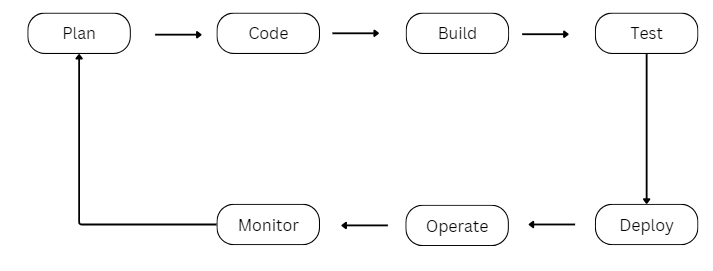

## DevOps Process 

DevOps Process is divided into 2 major process, Development and Operations, each consit of different sub process

- ##### Development
  - Plan
  - Code
  - Build
  - Test

- ##### Operation
  - Deploy
  - Operate
  - Monitor

 

##### Plan
The planning process involves understanding client requirement and transforming them into user cases and other software documentation

##### Code
The coding process where client requirement are coverted in computer codes. git is a popular tool used in the this stage to manage/monitor codes written by developers.

##### Build
This process involves validatingg your appliaction, compiling your application, performing unit and integration tests

##### Test
At this stage further test is carried out on the build application, from the previous phase

##### Deploy
The build software is deployed to the necessary server (Dev, Stage or Production server) after testing

##### Operate
At the stage, the deployed software is released and its worked on by the QA Team or client as the case maybe

##### Monitor
The software is been monitor for irregular behaviour and performance
